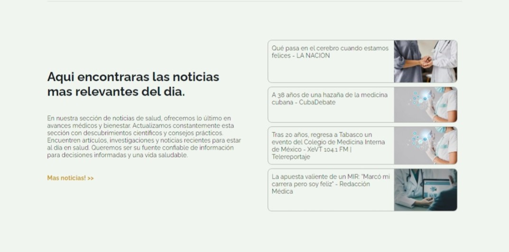

# Edad de Oro
#### Video Demo:  <URL HERE>
#### Description:

## CS50
>This is my final project for the CS50 Computer Science course.
## Technologies
>CSS, HTML, JavaScript, Python, Flask, Jinja.

## Explanation of the project
My final project is a website aimed at assisting the elderly with reminders, providing access to the latest health-related news, and allowing individuals from Mexico to view a government support calendar.

### Validation

For the validation of the page I use the libraries **werkzeug** for create a hash for the password, **email validation** for the email and **flask session** to track the current user, you can register and all the information goes to the table users:

For log in I consult the database to verifie if the email and the password actually exist and are correct and after that I allow the user to enter to the Homepage:

When you are in the homepage you can also log out clicking the **Cerrar sesion** button and this action all the function log_out() to clear the session.

### API news

To get the news for the homepage and the news web page I call the api **API news** and print all the retrieved information in HTML using Jinja:

### Reminders

Users have the ability to create reminders, view them on the home page and the reminders page. To create a new reminder, I use sqlite3 and flask to create a table where I can store the reminder, date and user id to identify the creator:

For viewing reminders I developed a function to get the reminders based on the id of the current user.

To delete the reminders I create a route to delete the reminder, based on its id:

## Pictures

### Sections

| Login                                        | Register                                           |
| -------------------------------------------- | -------------------------------------------------- |
|  |  |

| Reminders                                            | Supports                                           |
| ---------------------------------------------------- | -------------------------------------------------- |
|  |  |

| News                                       | Homepage                                           |
| ------------------------------------------ | -------------------------------------------------- |
|  |  |

## About CS50

This is CS50, Harvard University’s introduction to the intellectual enterprises of computer science and the art of programming, for concentrators and non-concentrators alike, with or without prior programming experience. (Two thirds of CS50 students have never taken CS before.) This course teaches you how to solve problems, both with and without code, with an emphasis on correctness, design, and style. Topics include computational thinking, abstraction, algorithms, data structures, and computer science more generally. Problem sets inspired by the arts, humanities, social sciences, and sciences. More than teach you how to program in one language, this course teaches you how to program fundamentally and how to teach yourself new languages ultimately. 

**Thanks CS50!**